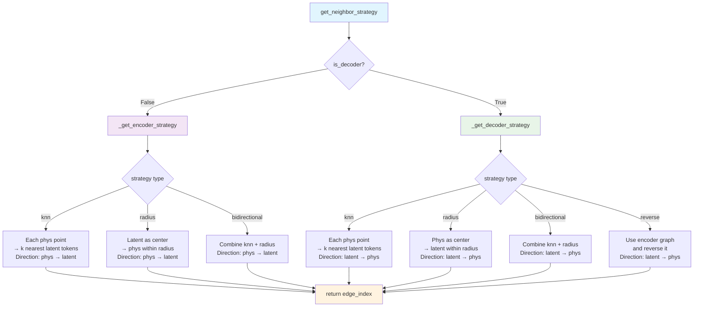

# :goat: Optimized Geometry-Aware Operator Transformer for Ultra-large 3D Implementation

This repository provides the optimized implementation of the Geometry-Aware Operator Transformer (GAOT) for ultra-large-scale 3D datasets. Large-scale 3D datasets typically have very high mesh resolutions, and each sample often comes with different point cloud densities. Therefore, compared to our other [**GAOT**](https://github.com/camlab-ethz/GAOT) repository, we have optimized the graph-building strategy and model workflow, and modified the data processing interface so that the model can directly handle VTK files.

We evaluated our model on three industry-scale datasets:
- DrivaerNet++: mesh resolution of 500K, 8,000 samples.
- NASA CRM: mesh resolution of 500K, 149 samples.
- DrivaerML: mesh resolution of 8 million - 10 million, 484 samples.

> Note: For the DrivaerNet++ dataset, we used 5,817 samples for training, 1,148 for validation, and 1,154 for testing, achieving a top-ranking score on the DrivaerNet++ Leaderboard. For the DrivaerML dataset, we used 400 samples for training, 34 for validation, and 50 for testing — to the best of our knowledge, this is the first time a full-resolution model has been trained without any downsampling.


Paper: **"Geometry Aware Operator Transformer as an efficient and accurate neural surrogate for PDEs on arbitrary domains".**

## Updates
***04/11/2025***
1. We provide the script for preprocessing the 3D dataset - DrivAerNet++
2. Update the config files and add the wandb for easily tracking the experiments.
3. Add the asychronous online-graph building strategy.


***13/09/2025***

1. Providing a more flexible graph-building strategy to effectively control the explosion in the number of edges in 3D scenarios.
2. Implemented a more flexible geometric embedding module, allowing it to be applied only in the encoder or only in the decoder if desired.
3. Adjusted the position where edge masking is applied.
4. Integrated the neural field feature into the main branch.

## Results
<p align="center">
  
  <br/>
  <em>Figure 1: Visualization of NASA CRM for the surface pressure.</em>
</p>

<p align="center">
  
  <br/>
  <em>Figure 2: Visualization of DrivAerML for the surface pressure.</em>
</p>


<p align="center">
  
  <br/>
  <em>Figure 3: Visualization of DrivAerNet++ for the surface pressure.</em>
</p>

<p align="center">
  
  <br/>
  <em>Figure 4: Visualization of DrivAerNet++ for the wall shear stress (x-component).</em>
</p>


**Error Metrics on DrivAerNet++ Dataset**

*Metrics are scaled: MSE (×10⁻²), Mean AE (×10⁻¹)*
| **Model** | **Pressure MSE** | **Pressure Mean AE** | **WSS MSE** | **WSS Mean AE** |
|-------------------|------------------|-----------------------|-------------|------------------|
| GAOT              | 4.2694           | 1.0699                | 8.6878      | 1.5429           |
| FIGConvNet        | 4.9900           | 1.2200                | 9.8600      | 2.2200           |
| TripNet           | 5.1400           | 1.2500                | 9.5200      | 2.1500           |
| RegDGCNN          | 8.2900           | 1.6100                | 13.8200     | 3.6400           |
| GAOT (NeurField)  | 12.0786          | 1.7826                | 22.9160     | 2.5099           |


## Updated Graph Building Strategy

## Installation

1.  **Create and activate a virtual environment (recommended):**
    
    ```bash
    python -m venv venv-gaot3d
    source venv-gaot3d/bin/activate
    ```
    For PyG-related packages (e.g., torch-scatter), run:
    ```bash
    pip install torch-scatter -f https://data.pyg.org/whl/torch-2.7.0+${CUDA}.html
    pip install torch-cluster -f https://data.pyg.org/whl/torch-2.7.0+${CUDA}.html
    ```
    Replace ${CUDA} with your CUDA version (e.g., cu128, cu121 or cpu).
    
2.  **Install dependencies:**
    ```bash
    pip install -r requirements.txt
    ```
    *Ensure you have PyTorch installed according to your CUDA version.*

## Dataset Setup

This model is primarily evaluated on the DrivAerNet++ dataset for surface pressure and wall shear stress prediction.

1.  **Download Data:** Obtain the original VTK files from the official [DrivAerNet repository](https://github.com/Mohamedelrefaie/DrivAerNet).
2.  **Organize Data:** Follow the instructions in the DrivAerNet++ repository regarding the order and naming of training and testing samples. Create an `order_use.txt` file (or similar, as referenced in `src/trainer/stat.py`) in your `dataset.base_path` directory, listing the base names of the VTK files in the desired sequence. We provide an example `dataset/drivaernet/order_use.txt`. 
3.  **Preprocess Data:**
    Convert the raw VTK files into PyTorch Geometric (`.pt`) files using the provided script:
    ```bash
    python dataset/drivaernet/drivaer_process_pressure.py
    ```
    * You might need to adjust paths and parameters within `drivaer_process_pressure.py` (e.g., `base_path`, `order_file`, `pressure_key`, `output_dir`).
    * The processed data will be stored in the directory specified by `output_dir` in the script, which should correspond to `{dataset.base_path}/{dataset.processed_folder}` in your configuration file.

4.  **Update Graph Structures (Optional but Recommended for Efficiency):**
    To improve training efficiency, especially for large datasets, you can pre-compute and save graph edge information directly into the `.pt` files.
    * Set `dataset.update_pt_files_with_edges: true` in your configuration file.
    * Run the training script once (it will perform the update and then can be stopped if only preprocessing is needed). This process iterates through the dataset, computes edges based on the model's MAGNO configuration (radius, strategy), and saves them.
    * After this step, set `dataset.update_pt_files_with_edges: false` and ensure `model.args.magno.precompute_edges: true` in your configuration for subsequent training runs to use these precomputed edges.

## How to Use

### Configuration

All experiment parameters are managed through configuration files (JSON or TOML format) located in the `config/` directory.

**Key Configuration Parameters:**

* **Dataset (`dataset` section):**
    * `base_path`: Path to your main dataset directory (e.g., `your_base_dataset_directory/`).
    * `processed_folder`: Subdirectory within `base_path` where the processed `.pt` files are stored (e.g., "processed\_pyg").
    * `name`: A descriptive name for your dataset configuration (e.g., "drivaernet\_fullpressure").
    * `metaname`: Identifier for dataset metadata, used to load physical properties like domain bounds and normalization statistics (see `src/data/dataset.py`).
    * `train_size`, `val_size`, `test_size`: Number of samples for each split.
    * `update_pt_files_with_edges`: Set to `true` to compute and save edge information into `.pt` files during the initial run. Set to `false` afterwards.
* **Setup (`setup` section):**
    * `train`: Set to `true` for training, `false` for inference.
    * `test`: Set to `true` for testing/inference (usually after setting `setup.train: false`).
    * `ckpt`: Set to `true` to load a checkpoint before starting training (resume).
    * `trainer_name`: Currently supports `static3d` for time-independent 3D datasets where geometry varies across samples.
    * `distributed`: Set to `true` for distributed training.
* **Model (`model` section):**
    * `name`: Model type, currently `gaot_3d`.
    * `args.latent_tokens`: Dimensions (D, H, W) of the latent token grid.
    * `args.magno`: Configuration for the MAGNO encoder/decoder (see `src/model/layers/magno.py` for details like `gno_radius`, `lifting_channels`, `neighbor_strategy`, `use_geoembed`, `precompute_edges`).
    * `args.transformer`: Configuration for the Transformer processor (see `src/model/layers/attn.py` for details like `patch_size`, `hidden_size`, `num_layers`, `positional_embedding`).
* **Paths (`path` section):**
    * Defines where checkpoints (`ckpt_path`), loss plots (`loss_path`), result visualizations (`result_path`), and metrics databases (`database_path`) are stored.

For a detailed explanation of all configuration options and their default values, refer to `src/trainer/utils/default_set.py`.

Example configuration files are provided in `config/examples/drivaernet/`.
### Training

To train a model, execute `main.py` with the path to your configuration file:

```bash
python main.py --config [path_to_your_config_file.json_or_toml]
```

For example:
```bash
python main.py --config config/examples/drivaernet/pressure/pressure.json
```

To run all configuration files within a specific folder:

```
python main.py --folder [path_to_your_config_folder]
```


Command-line Options for `main.py`:

* `--config <path>`: Path to a single configuration file.
* `--folder <path>`: Path to a folder containing multiple configuration files.
* `--debug`: Run in debug mode (may affect multiprocessing).
* `--num_works_per_device <int>`: Number of parallel workers per device (default: 10).
* `--visible_devices <int ...>`: Specify which CUDA devices to use (e.g., --visible_devices 0 1).

During training, checkpoints, loss curves, visualizations, and a CSV database of metrics will be saved to the directories specified in the `path` section of your configuration file.

### Inference
To run inference using a trained model:
1. Modify your configuration file:
   * Set `setup.train: false`.
   * Set `setup.test: true`.
   * Ensure `path.ckpt_path` points to the desired model checkpoint file (`.pt`).

1. Run `main.py` with the updated configuration:
    ```bash
    python main.py --config [path_to_your_config_file.json_or_toml]
    ```
## Project Structure
```
GAOT-3D/
├── assets/                 # Images for README
├── config/                 # Configuration files (JSON, TOML)
│   ├── examples/           # Example configurations
│   └── ...
├── dataset/                # Dataset related scripts
│   └── drivaernet/
│       └── drivaer_process.py # Script to convert VTK to .pt
├── src/
│   ├── data/               # Data loading, datasets, transforms
│   │   ├── dataset.py
│   │   ├── pyg_datasets.py
│   │   └── pyg_transforms.py
│   ├── model/              # Model definitions
│   │   ├── layers/         # Model layers (attention, MAGNO, MLP, etc.)
│   │   ├── gaot_3d.py
│   │   └── __init__.py
│   ├── trainer/            # Training and evaluation logic
│   │   ├── utils/          # Utility functions for training (setup, metrics, plots, defaults)
│   │   ├── base.py
│   │   ├── optimizers.py
│   │   └── stat.py         # Static 3D trainer
│   └── utils/              # General utility functions
├── main.py                 # Main script for training and inference
└── requirements.txt        # Python package dependencies
```
## Citation
```
@article{wen2025goat,
  title        = {Geometry Aware Operator Transformer as an Efficient and Accurate Neural Surrogate for PDEs on Arbitrary Domains},
  author       = {Wen, Shizheng and Kumbhat, Arsh and Lingsch, Levi and Mousavi, Sepehr and Zhao, Yizhou and Chandrashekar, Praveen and Mishra, Siddhartha},
  year         = {2025},
  eprint       = {2505.18781},
  archivePrefix= {arXiv},
  primaryClass = {cs.LG}
}
```
